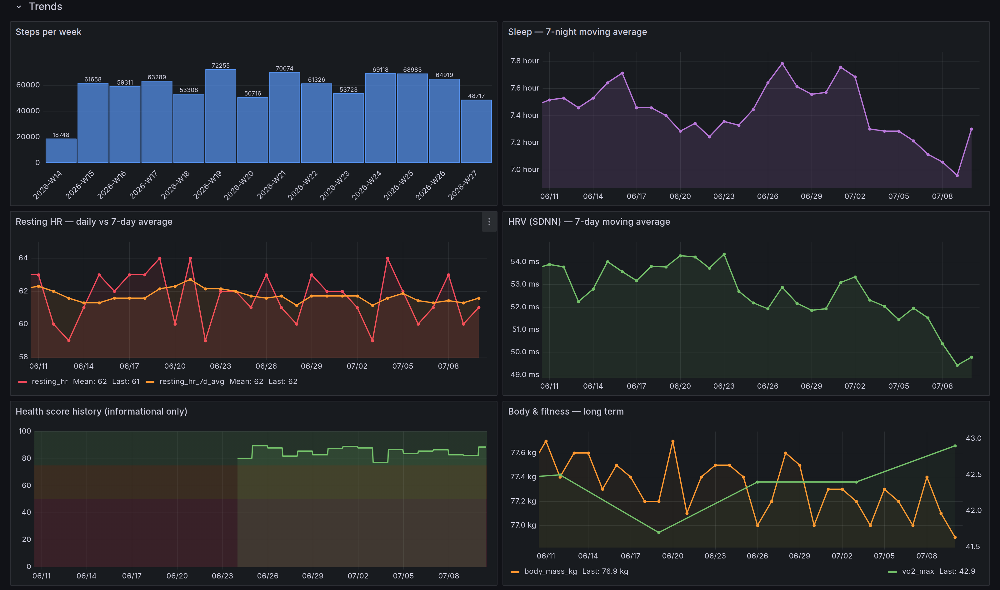
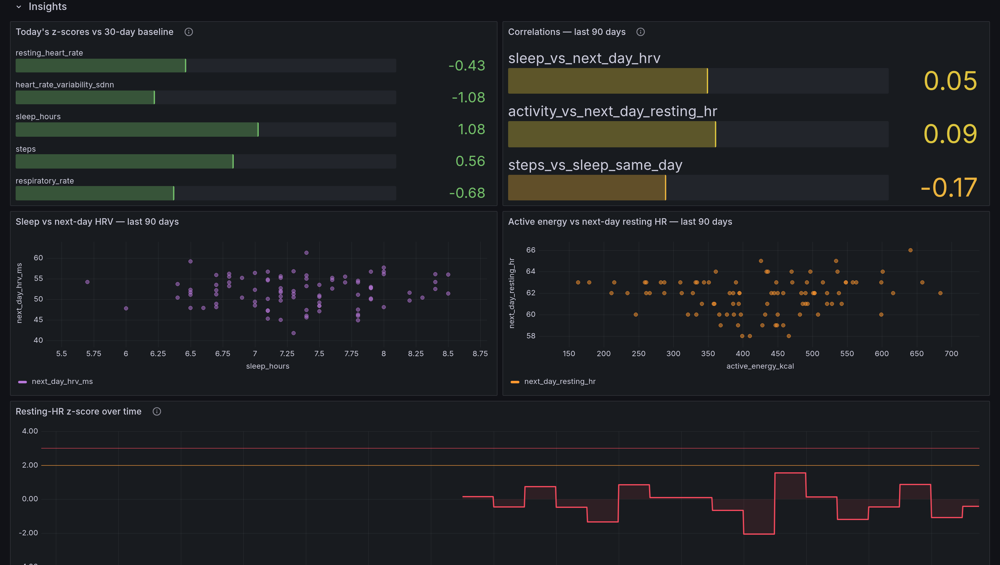

# PulseBoard

[](https://github.com/saglamh35/pulseboard/actions/workflows/ci.yml)


Self-hosted observability for your own body: Apple Watch / iPhone health
data flows into a FastAPI ingest service, lands in SQLite, and is exposed to
Prometheus through a custom exporter — with a provisioned Grafana dashboard
on top. Built to rehearse the production Prometheus/Grafana exporter pattern
on data I actually care about.


## Features

- **Live dashboard** — today's steps, resting HR, sleep, health score,
  heart-rate range and activity progress, refreshed every scrape.
- **Data freshness watchdog** — a dashboard stat plus a provisioned alert
  fire when the phone stops syncing for 2 days.
- **Correlation & anomaly insights** — lag-aware correlations (sleep ↔
  next-day HRV, activity ↔ next-day resting HR) and day-vs-baseline
  z-scores, on the dashboard and at `GET /insights`.
- **Recovery & goals** — a morning readiness score (HRV + resting HR +
  sleep), registry-declared daily goals with streak gauges, 14-night sleep
  debt, and acute:chronic training load (ACWR) with a "ramping too fast"
  alert.
- **Weekly report & notifications** — Monday-morning week-over-week summary
  with push delivery via ntfy or Telegram.
- **AI weekly coach (opt-in)** — a local Ollama model (or Claude/GPT/Gemini
  via env keys) turns the week's numbers into a short motivating note with
  goals for next week; plus no-key "Ask Claude / Ask ChatGPT" links and a
  ready-made prompt endpoint for your phone.
- **Three ingestion paths** — Health Auto Export app, plain Apple Shortcut,
  or a streaming `export.xml` backfill for years of history.
- **Setup wizard** — `python -m pulseboard.doctor` checks the whole pipeline
  and tells you exactly what to fix.
- **Runs anywhere** — Docker Compose on a laptop or a Helm chart on a
  home-lab cluster; dashboards, datasources and alerts all provisioned as
  code.
- **Private by default** — localhost-only ports, optional bearer-token auth,
  synthetic sample data in the repo, and a firm *not medical advice* stance.

Curious where it's heading? See [docs/ROADMAP.md](docs/ROADMAP.md).

## TL;DR

```bash
git clone https://github.com/saglamh35/pulseboard && cd pulseboard
docker compose up -d --build
open http://127.0.0.1:3000        # Grafana — the dashboard is already provisioned
```

Then feed it: backfill your Apple Health `export.xml` once, and point an
Apple Shortcut or the Health Auto Export app at `POST /ingest` for daily
values. Everything stays on your machine; nothing is exposed beyond
localhost. Not medical advice — it's a dashboard, not a doctor.

```
 Apple Watch / iPhone
   │
   ├── Apple Shortcut / Health Auto Export ──POST /ingest──┐
   │                                                       ▼
   └── export.xml ──python -m pulseboard.backfill──▶  ┌──────────┐
                                                      │  SQLite  │  system of record
                                                      └────┬─────┘  (every day, forever)
                                                           │
                                    ┌──────────────────────┼─────────────────────┐
                                    │ latest day, per scrape                     │ full history (ro)
                                    ▼                                            ▼
                            GET /metrics  ◀──scrape── Prometheus ──▶ Grafana ◀───┘
                            (custom Collector)                      Live row + History row
```

## Quick start

```bash
docker compose up -d --build
```

- API: `http://127.0.0.1:8000` (`/health`, `/status`, `/ingest`, `/metrics`,
  `/insights`, `/report/weekly`)
- Prometheus: `http://127.0.0.1:9090`
- Grafana: `http://127.0.0.1:3000` (admin/admin on first login) — the
  **PulseBoard** dashboard is provisioned automatically.

Push a first value and watch it flow through:

```bash
curl -X POST http://127.0.0.1:8000/ingest \
  -H 'Content-Type: application/json' \
  -d '{"date": "2026-07-09", "metrics": [{"name": "steps", "value": 8250}]}'

curl http://127.0.0.1:8000/metrics   # -> pulseboard_steps 8250.0
```

### Backfill your history

Export from the Health app (Profile → **Export All Health Data**), unzip,
then stream the XML into SQLite (constant memory, idempotent):

```bash
docker cp export.xml pulseboard:/tmp/export.xml
docker exec pulseboard python -m pulseboard.backfill /tmp/export.xml
```

### Keep it fresh daily

Point the Health Auto Export app (recommended) or an Apple Shortcut at
`POST /ingest` on an hourly automation — [docs/SHORTCUT.md](docs/SHORTCUT.md)
walks through both. Both shapes land on the same endpoint; days overlap
safely because every row is upserted per `(date, metric, aggregation)`.
The dashboard's **Data freshness** stat and a provisioned alert tell you
when the pipeline stalls, and `python -m pulseboard.doctor` checks the whole
setup end to end. Exposing the API beyond localhost (Tailscale etc.)? Set
`PULSEBOARD_API_TOKEN` to require a bearer token on `/ingest`.

### Or run it on Kubernetes

A Helm chart under `deploy/helm/pulseboard/` deploys the same three-service
stack to a home-lab cluster — ClusterIP-only (reach it via
`kubectl port-forward`, same localhost ethos), PVC-backed, with the Grafana
provisioning shipped as ConfigMaps. See [docs/K8S.md](docs/K8S.md).

## Why Prometheus AND SQLite?

Because they answer different questions, and pretending one tool does both
is how dashboards lie. Health data is **daily values, often backfilled
months later** — Prometheus timestamps samples at scrape time and simply
cannot represent "steps for last March". So:

- **SQLite** is the system of record: every day ever ingested, charted
  directly by Grafana's *History* row through a read-only mount.
- **Prometheus** sees only the latest day per scrape: the *Live* row,
  PromQL, scrape targets — the real exporter workflow, exercised end to end.

The full reasoning lives in [docs/OBSERVABILITY.md](docs/OBSERVABILITY.md).

## Dashboard

The provisioned dashboard is organized top-down, from "how am I right now"
to "what does it mean":

**Today** (hero above): live stats with sparklines, the health-score gauge
(a documented toy heuristic, [docs/SCORE.md](docs/SCORE.md) —
**informational only, not medical advice**), heart-rate range, activity
progress, plus **Data freshness** and **Last ingest** so a stalled phone
automation is impossible to miss.

**History** charts every stored day straight from SQLite, and **Trends**
adds weekly rollups, 7-day moving averages, health-score history and
long-term body/fitness lines:



**Insights** shows what the numbers relate to: today's z-scores against
your own 30-day baseline (anomaly detection), lag-aware correlations, and
the scatter plots behind them ([docs/INSIGHTS.md](docs/INSIGHTS.md) —
correlation is not causation):



A final row drills deeper: **sleep stages per night** (core/deep/REM/awake,
stacked) and a **recent workouts table** fed by a per-session `workouts`
table that every ingestion path fills alongside the daily rollups.

Provisioned **Grafana alert rules** watch the derived gauges — resting HR
rising 3+ days, sleep/steps averages dipping, data staleness, and
baseline anomalies ([docs/ALERTING.md](docs/ALERTING.md)).

## Weekly report & notifications

`python -m pulseboard.report` builds a Monday–Sunday week-over-week summary
(markdown or HTML) with workouts and anomalies, and can push a short digest
via **ntfy** or **Telegram**. Schedule it with cron, the compose `reports`
profile, or the Helm CronJob; `--check-freshness --notify` doubles as a
"data stopped arriving" watchdog. See [docs/REPORTS.md](docs/REPORTS.md).

## Project layout

```
pulseboard/            the Python package
├── app.py             FastAPI app factory: /ingest, /status, /insights, /report/weekly, /metrics
├── metrics.py         canonical metric registry (single source of truth)
├── db.py              SQLite schema + idempotent upsert + queries
├── exporter.py        custom prometheus_client Collector
├── score.py           0-100 composite health score
├── readiness.py       0-100 morning readiness score (recovery inputs only)
├── goals.py           daily goal streaks + weekly hit counts + sleep debt
├── training_load.py   acute:chronic workout-load ratio (ACWR)
├── insights.py        correlations + baseline anomaly z-scores
├── report.py          weekly report CLI (markdown/HTML, --notify, --loop)
├── coach.py           opt-in AI weekly coach (Ollama default; Claude/GPT/Gemini via env)
├── notify.py          ntfy / Telegram push (stdlib urllib)
├── doctor.py          setup wizard: end-to-end pipeline checks
├── backfill.py        streaming export.xml backfill CLI
├── trends.py          rolling averages + rising-days trend gauges
└── ingest/            payload validation + Health Auto Export adapter
prometheus/            scrape config
deploy/helm/           Helm chart for home-lab Kubernetes (docs/K8S.md)
grafana/               provisioned datasources + dashboard JSON
samples/               synthetic payloads & export.xml used by the tests
docs/                  INGEST, SHORTCUT, INSIGHTS, REPORTS, SCORE, GOALS, TRAINING_LOAD, AI_COACH, OBSERVABILITY, ALERTING, K8S, ROADMAP
```

## Development

```bash
python -m venv .venv && .venv/bin/pip install -r requirements-dev.txt -e .
.venv/bin/pytest
.venv/bin/ruff check . && .venv/bin/ruff format --check .
.venv/bin/mypy
```

CI runs the same checks (ruff, mypy, pytest on 3.11/3.12) plus Helm chart
validation (`helm lint` + kubeconform) on every push and pull request.

## Privacy

This is *personal* health data — treat the deployment accordingly:

- All ports bind to `127.0.0.1` only; nothing is exposed beyond the host.
  Don't forward these ports. If you deliberately expose the API on a private
  network (Tailscale/WireGuard), set `PULSEBOARD_API_TOKEN` so `/ingest`
  requires a bearer token.
- The repository ships **synthetic sample data only**. `.gitignore` blocks
  `export.xml`, `*.db` and `data/` so real data can't be committed by
  accident.
- The health score and every chart are informational; nothing here is
  medical advice or a diagnostic tool.

## License

[MIT](LICENSE)
