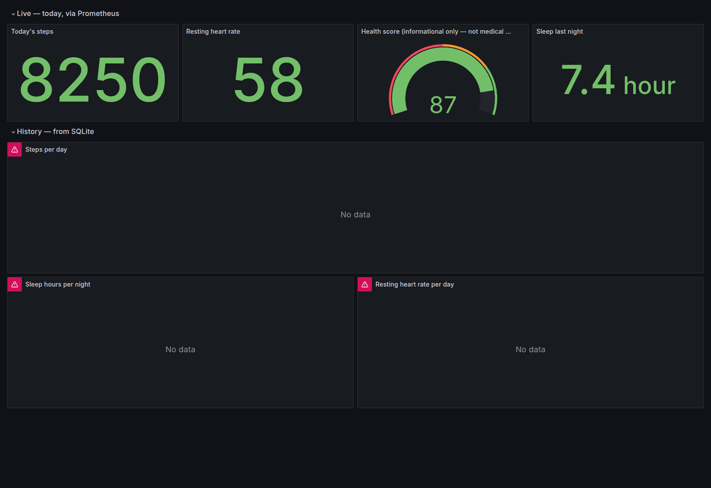

# PulseBoard

[](https://github.com/saglamh35/pulseboard/actions/workflows/ci.yml)


Self-hosted observability for your own body: Apple Watch / iPhone health
data flows into a FastAPI ingest service, lands in SQLite, and is exposed to
Prometheus through a custom exporter — with a provisioned Grafana dashboard
on top. Built to rehearse the production Prometheus/Grafana exporter pattern
on data I actually care about.

```
 Apple Watch / iPhone
   │
   ├── Apple Shortcut / Health Auto Export ──POST /ingest──┐
   │                                                       ▼
   └── export.xml ──python -m pulseboard.backfill──▶  ┌──────────┐
                                                      │  SQLite  │  system of record
                                                      └────┬─────┘  (every day, forever)
                                                           │
                                    ┌──────────────────────┼─────────────────────┐
                                    │ latest day, per scrape                     │ full history (ro)
                                    ▼                                            ▼
                            GET /metrics  ◀──scrape── Prometheus ──▶ Grafana ◀───┘
                            (custom Collector)                      Live row + History row
```

## Quick start

```bash
docker compose up -d --build
```

- API: `http://127.0.0.1:8000` (`/health`, `/ingest`, `/metrics`)
- Prometheus: `http://127.0.0.1:9090`
- Grafana: `http://127.0.0.1:3000` (admin/admin on first login) — the
  **PulseBoard** dashboard is provisioned automatically.

Push a first value and watch it flow through:

```bash
curl -X POST http://127.0.0.1:8000/ingest \
  -H 'Content-Type: application/json' \
  -d '{"date": "2026-07-09", "metrics": [{"name": "steps", "value": 8250}]}'

curl http://127.0.0.1:8000/metrics   # -> pulseboard_steps 8250.0
```

### Backfill your history

Export from the Health app (Profile → **Export All Health Data**), unzip,
then stream the XML into SQLite (constant memory, idempotent):

```bash
docker cp export.xml pulseboard:/tmp/export.xml
docker exec pulseboard python -m pulseboard.backfill /tmp/export.xml
```

### Keep it fresh daily

Point an Apple Shortcut ([docs/SHORTCUT.md](docs/SHORTCUT.md)) or the
Health Auto Export app ([docs/INGEST.md](docs/INGEST.md)) at
`POST /ingest`. Both shapes land on the same endpoint; days overlap safely
because every row is upserted per `(date, metric, aggregation)`.

## Why Prometheus AND SQLite?

Because they answer different questions, and pretending one tool does both
is how dashboards lie. Health data is **daily values, often backfilled
months later** — Prometheus timestamps samples at scrape time and simply
cannot represent "steps for last March". So:

- **SQLite** is the system of record: every day ever ingested, charted
  directly by Grafana's *History* row through a read-only mount.
- **Prometheus** sees only the latest day per scrape: the *Live* row,
  PromQL, scrape targets — the real exporter workflow, exercised end to end.

The full reasoning lives in [docs/OBSERVABILITY.md](docs/OBSERVABILITY.md).

## Dashboard



*Live row (Prometheus): today's steps, resting heart rate, health score,
sleep. History row (SQLite): steps, sleep and resting-HR over months.*

The health-score gauge is a documented toy heuristic
([docs/SCORE.md](docs/SCORE.md)) — **informational only, not medical
advice**.

## Project layout

```
pulseboard/            the Python package
├── app.py             FastAPI app factory: /ingest, /health, /metrics
├── metrics.py         canonical metric registry (single source of truth)
├── db.py              SQLite schema + idempotent upsert + queries
├── exporter.py        custom prometheus_client Collector
├── score.py           0-100 composite health score
├── backfill.py        streaming export.xml backfill CLI
└── ingest/            payload validation + Health Auto Export adapter
prometheus/            scrape config
grafana/               provisioned datasources + dashboard JSON
samples/               synthetic payloads & export.xml used by the tests
docs/                  INGEST, SHORTCUT, SCORE, OBSERVABILITY
```

## Development

```bash
python -m venv .venv && .venv/bin/pip install -r requirements-dev.txt -e .
.venv/bin/pytest
.venv/bin/ruff check . && .venv/bin/ruff format --check .
.venv/bin/mypy
```

CI runs the same three jobs (ruff, mypy, pytest on 3.11/3.12) on every push
and pull request.

## Privacy

This is *personal* health data — treat the deployment accordingly:

- All ports bind to `127.0.0.1` only; nothing is exposed beyond the host,
  and there is no authentication in the MVP. Don't forward these ports.
- The repository ships **synthetic sample data only**. `.gitignore` blocks
  `export.xml`, `*.db` and `data/` so real data can't be committed by
  accident.
- The health score and every chart are informational; nothing here is
  medical advice or a diagnostic tool.

## License

[MIT](LICENSE)
